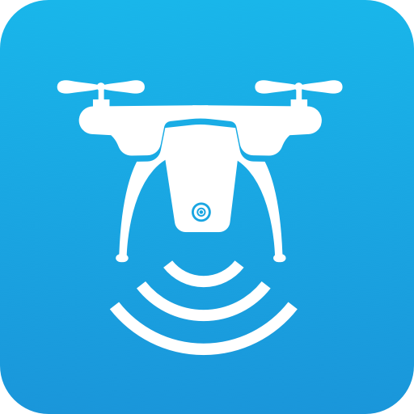

<p align="center">
   <a href="https://bintray.com/jessyancoding/maven/MVPArms/_latestVersion">
    
  </a>
  <a href="https://travis-ci.org/JessYanCoding/MVPArms">
    
  </a>
  <a href="https://developer.android.com/about/versions/android-4.0.html">
    
  </a>
  <a href="http://www.apache.org/licenses/LICENSE-2.0">
    
  </a>
  <a href="https://www.jianshu.com/u/1d0c0bc634db">
    
  </a>
  <a href="https://shang.qq.com/wpa/qunwpa?idkey=7e59e59145e6c7c68932ace10f52790636451f01d1ecadb6a652b1df234df753">
    
  </a>
</p>

<p align="center">
  <a href="MVPArms.md">
    <b>中文说明</b>
  </a>
</p> 

## A common Architecture for Android Applications developing based on MVP, integrates many Open Source Projects (like Dagger2、RxJava、Retrofit ...), to make your developing quicker and easier.

## Architectural


## Usage
> New Project (**The following steps are too cumbersome? Now you can use the [new feature (generate an app Module with one click)](https://github.com/JessYanCoding/MVPArms-Module-Template) in new projects, to avoid the cumbersome configuration of the project, to quickly open the world of MVPArms**)
>> If you are building a new project, directly to the entire project **clone** (or download), as **demo** as the main **Module** (It is recommended to remove the **arms Module** and use **Gradle** to [depend](https://github.com/JessYanCoding/MVPArms/wiki#1.1) on this framework remotely for easy updates), then the package name into their own package name, **demo Module** contains the package structure can be used directly, a mainstream `MVP` +` Dagger2` + `Retrofit` +` RxJava` framework so easy to build successful, and now you refer **Mvp** Package under the **UserActivity** format, [Use Template to automatically generate MVP, Dagger2 related classes](https://github.com/JessYanCoding/MVPArmsTemplate), With access to [Wiki documents](https://github.com/JessYanCoding/MVPArms/wiki) slowly grasp the framework to see more articles as soon as possible in the project to use it, in practice, learning is the fastest

> Old Project
>> [Old projects would like to introduce this framework, you can refer to the Wiki documentation, written in great detail](https://github.com/JessYanCoding/MVPArms/wiki)

## Wiki
[Detailed usage reference Wiki (**Must see!!!**)](https://github.com/JessYanCoding/MVPArms/wiki)


## Notice

* [MVPArms Learning Project](https://github.com/JessYanCoding/MVPArms/blob/master/CONTRIBUTING_APP.md)

* [Collection Box](https://github.com/JessYanCoding/MVPArms/issues/40)

* [Update Log](https://github.com/JessYanCoding/MVPArms/wiki/UpdateLog)

* [Common Issues](https://github.com/JessYanCoding/MVPArms/wiki/Issues)

* The use of these technologies for the latter part of the project maintenance and iterative, especially large projects is very helpful, but is to develop a pre-write a page to write a lot of `MVP`,` Dagger2` class and interface, which is indeed a headache for the development of pre- Now the framework has been able to [Template](https://github.com/JessYanCoding/MVPArmsTemplate) automatically generate some `MVP`,` Dagger2` template code, and now we can very easily use the framework.

* Use this frame comes with automatic screen adaptation function, please refer to [AndroidAutoSize](https://github.com/JessYanCoding/AndroidAutoSize).

* This framework does not provide any third-party libraries associated with the **UI**.

## Functionality & Libraries
1. [`Mvp` Google's official` Mvp` architecture project, which contains several different schema branches (this is the Dagger branch).](https://github.com/googlesamples/android-architecture/tree/todo-mvp-dagger/)
2. [`Dagger2`](https://github.com/google/dagger)
3. [`RxJava`](https://github.com/ReactiveX/RxJava)
4. [`RxAndroid`](https://github.com/ReactiveX/RxAndroid)
5. [`Rxlifecycle`](https://github.com/trello/RxLifecycle)
6. [`RxCache`](https://github.com/VictorAlbertos/RxCache)
7. [`RxPermissions`](https://github.com/tbruyelle/RxPermissions)
8. [`RxErroHandler`](https://github.com/JessYanCoding/RxErrorHandler)
9. [`Retrofit`](https://github.com/square/retrofit)
10. [`Okhttp`](https://github.com/square/okhttp)
11. [`AndroidAutoSize`](https://github.com/JessYanCoding/AndroidAutoSize)
12. [`Gson`](https://github.com/google/gson)
13. [`Butterknife`](https://github.com/JakeWharton/butterknife)
14. [`AndroidEventBus`](https://github.com/hehonghui/AndroidEventBus)
15. [`Timber`](https://github.com/JakeWharton/timber)
16. [`Glide`](https://github.com/bumptech/glide)
17. [`LeakCanary`](https://github.com/square/leakcanary)

## Who is using MVPArms?

**天府通** | **小顶家装 工长端** | **小顶家装 工人端** | **小顶家装 材料端** | **小顶网** |
:-------------------------------------------------------------------:|:----------:|:---------------:|:--------:|:--------------:|
[](https://android.myapp.com/myapp/detail.htm?apkName=com.chinarainbow.tft) | [](http://www.dggxdjz.com) | [](http://www.dggxdjz.com) | [](http://www.dggxdjz.com) | [](http://www.dgg.net/appload.htm) |
**天天视频** | **天天直播** | **中斗通航** | **中斗祥云** | **麋鹿旅行** |
[](http://sj.qq.com/myapp/detail.htm?apkName=com.dzwh.ttys) | [](http://www.25pp.com/android/detail_7611392/) | [](https://fir.im/3176) |   | [](http://android.myapp.com/myapp/detail.htm?apkName=com.elk.tourist) |
**汇财富** | **觅窝** | **晒墨宝** | **智播**  | **(Your App ...)** |
[](http://android.myapp.com/myapp/detail.htm?apkName=com.tahone.client) | [](http://miwo.ai/) | [](http://sj.qq.com/myapp/search.htm?kw=%E6%99%92%E5%A2%A8%E5%AE%9D)  | [](http://www.zhibocloud.cn/) |  |


## Acknowledgements 
Thanks to all the three libraries used in this framework **Author**, and all for the **Open Source** selfless contributions **Developer** and **Organizations**, so that we can better work and study, I will also spare time return to the open source community

## About Me
* **Email**: <jess.yan.effort@gmail.com>  
* **Home**: <http://jessyan.me>
* **掘金**: <https://juejin.im/user/57a9dbd9165abd0061714613>
* **简书**: <https://www.jianshu.com/u/1d0c0bc634db>

## License
``` 
 Copyright 2016, jessyan       
  
   Licensed under the Apache License, Version 2.0 (the "License");
   you may not use this file except in compliance with the License.
   You may obtain a copy of the License at 
 
       http://www.apache.org/licenses/LICENSE-2.0 

   Unless required by applicable law or agreed to in writing, software
   distributed under the License is distributed on an "AS IS" BASIS,
   WITHOUT WARRANTIES OR CONDITIONS OF ANY KIND, either express or implied.
   See the License for the specific language governing permissions and
   limitations under the License.
```
